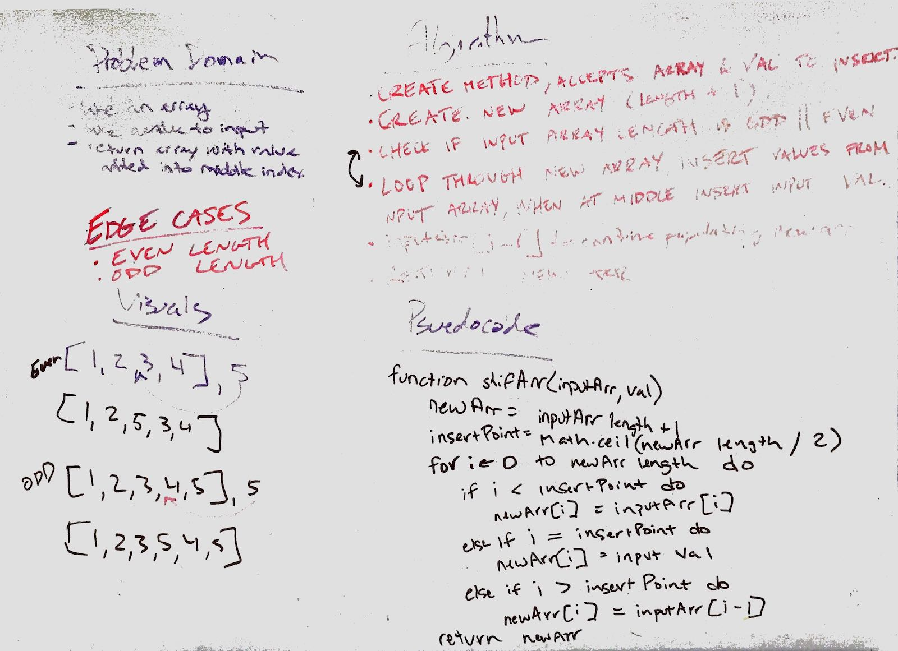

# Challenge Summary
Array Shift

## Challenge Description
Insert and shift an array in middle at index

## Approach & Efficiency
- Get the middle index
- If the input array is an odd number, round up to get the middle index

## Solution
[Link to code](../challenges/src/main/java/challenges/ArrayShift.java)
[Link to tests](../challenges/src/test/java/challenges/ArrayShiftTest.java)
