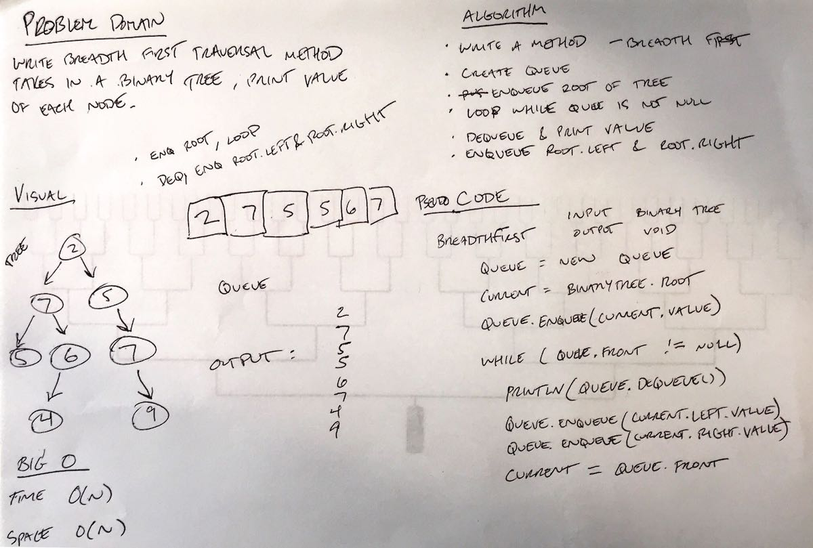

# Challenge Summary
Implement a breadth first traversal method

## Challenge Description
- Write a breadth first traversal method which takes a Binary Tree as its unique input. Without utilizing any of the built-in methods available to your language, traverse the input tree using a Breadth-first approach; print every visited node’s value.

## Approach & Efficiency
- Use a queue to add and remove nodes in breadth-first order
- Print value when removing node

## Solution
- [Link to code](../challenges/src/main/java/challenges/Tree/BinaryTree.java)
- [Link to tests](../challenges/src/test/java/challenges/Tree/BinaryTreeTest.java)

