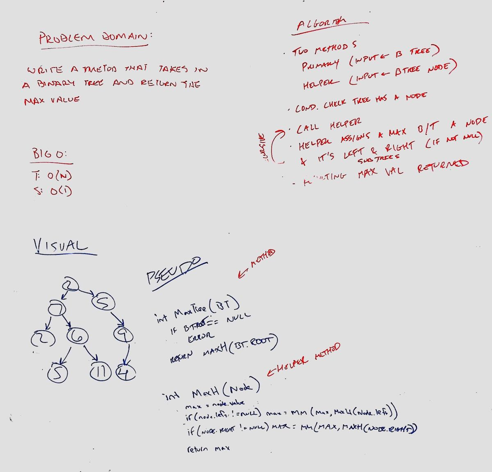

# Trees
Find the Maximum Value in a Binary Tree

## Challenge
- Write a function called find-maximum-value which takes binary tree as its only input. Without utilizing any of the built-in methods available to your language, return the maximum value stored in the tree. You can assume that the values stored in the Binary Tree will be numeric.

## Approach & Efficiency
- Use recursion to return the max value of a tree
- Big O
  - Time O(n)
  - Space O(1)

## Solution
- [Link to code](../challenges/src/main/java/challenges/Tree/BinaryTree.java)
- [Link to tests](../challenges/src/test/java/challenges/Tree/BinaryTreeTest.java)
