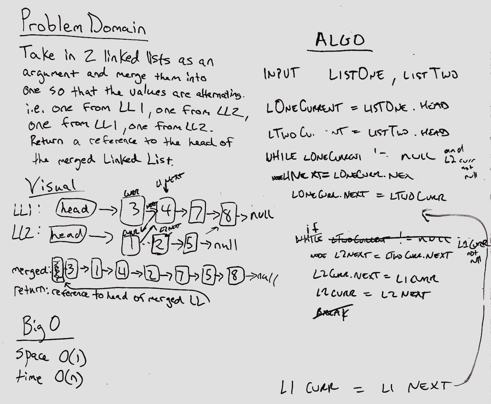

# Challenge Summary
Merge two linked lists

## Challenge Description
Write a function called mergeLists which takes two linked lists as arguments. Zip the two linked lists together into one so that the nodes alternate between the two lists and return a reference to the head of the zipped list. Try and keep additional space down to O(1). You have access to the Node class and all the properties on the Linked List class as well as the methods created in previous challenges.

## Approach & Efficiency
- Loop through both lists so long as `node.next != null`
- Create helper pointer variables
- Change the next pointers so that you get a merged list
- Big O: O(n) time & O(1) space

## Solution
- [Link to code](../challenges/src/main/java/challenges/LinkedList/LinkedList.java)
- [Link to tests](../challenges/src/test/java/challenges/LinkedList/LinkedListTest.java)

