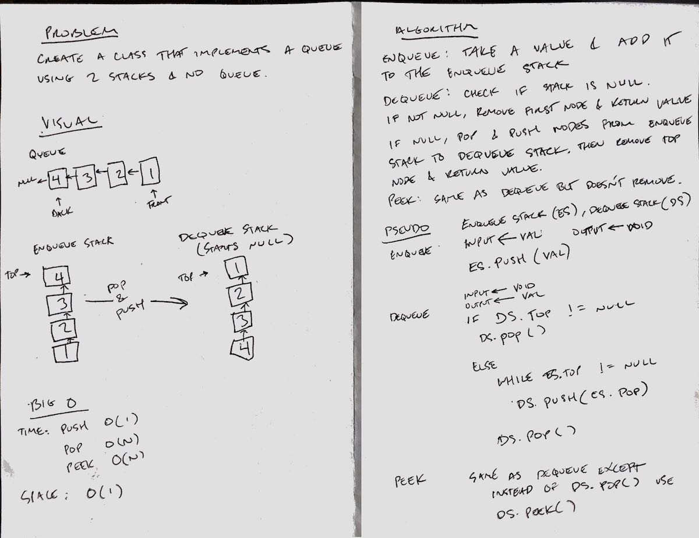

# Challenge Summary
Implement a Queue using two Stacks

## Challenge Description
Create a brand new PseudoQueue class. Do not use an existing Queue. Instead, this PseudoQueue class will implement our standard queue interface (the two methods listed below), but will internally only utilize 2 Stack objects. Ensure that you create your class with the following methods:

- enqueue(value) which inserts value into the PseudoQueue, using a first-in, first-out approach.
- dequeue() which extracts a value from the PseudoQueue, using a first-in, first-out approach.

The Stack instances have only push, pop, and peek methods. You should use your own Stack implementation. Instantiate these Stack objects in your PseudoQueue constructor.

## Approach & Efficiency
- One stack is used as the enqueue stack
- One stack is used as the dequeue stack
- Use the stack methods to simulate a queue's methods

## Solution
- [Link to code](../challenges/src/main/java/challenges/stacksandqueues/PseudoQueue.java)
- [Link to tests](../challenges/src/test/java/challenges/stacksandqueues/PseudoQueueTest.java)

