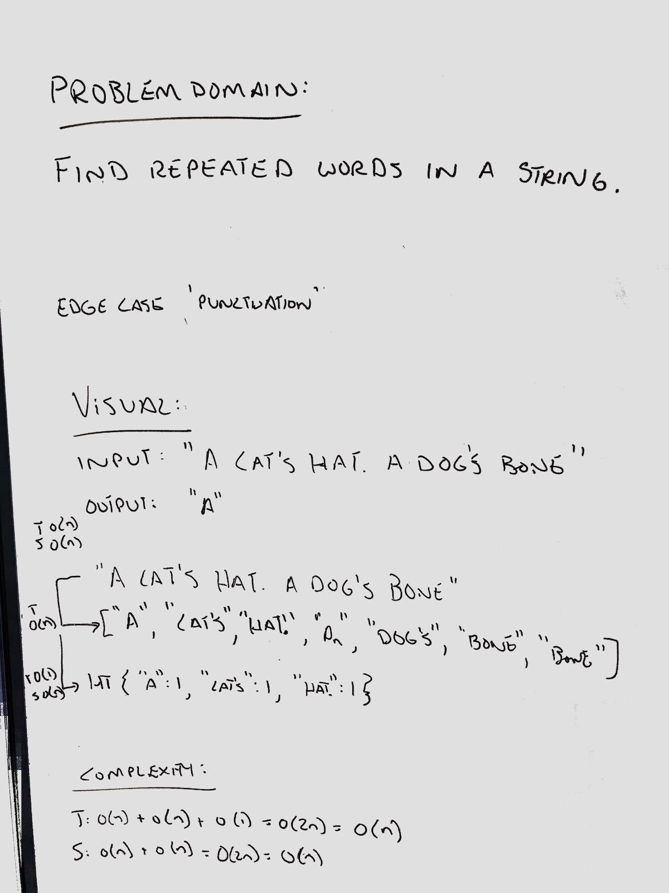
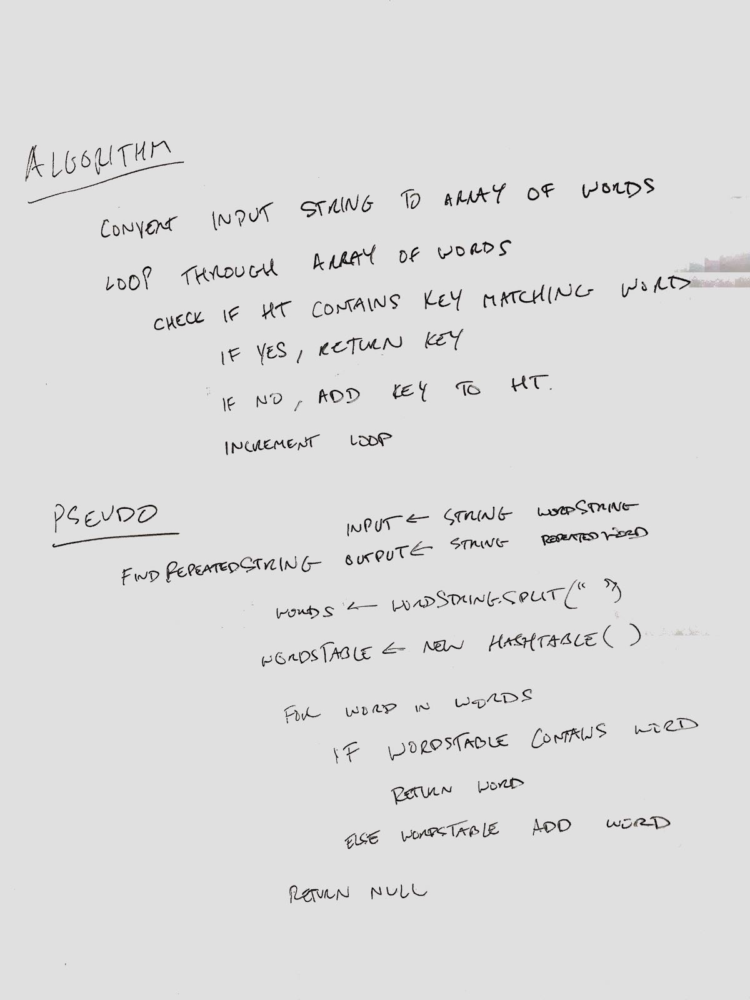

# Repeated Word

## Challenge
- Find the first repeated word in a book.

## Approach & Efficiency
- Split input string into array
- Loop over array
  - Check if array value is already a key in hashtable. If so, return that value.
  - If not, add value as key.

## Solution
- [Link to code](../challenges/src/main/java/challenges/RepeatedWord/RepeatedWord.java)
- [Link to tests](../challenges/src/test/java/challenges/RepeatedWord/RepeatedWordTest.java)

