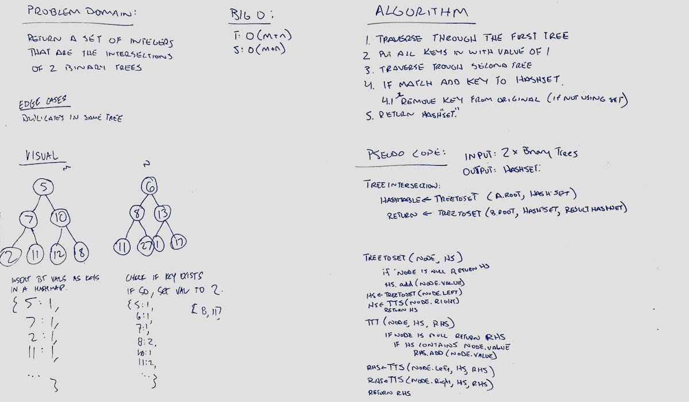

# Tree Intersection

## Challenge
- Find common values in 2 binary trees.

## Approach & Efficiency
- 

## Solution
- [Link to code](../challenges/src/main/java/challenges/Tree/TreeIntersection/TreeIntersection.java)
- [Link to tests](../challenges/src/test/java/challenges/Tree/TreeIntersection/TreeIntersectionTest.java)
